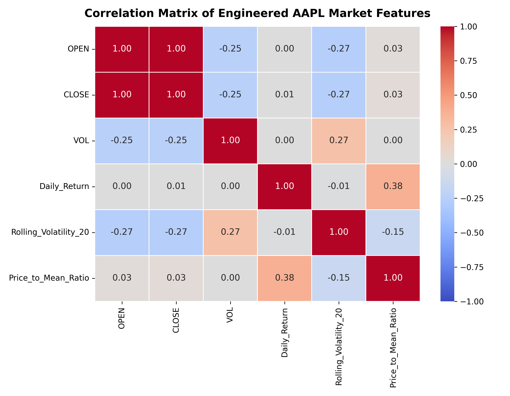

# Algorithmic Trading Research : Apple (AAPL) Market Data Analysis

This folder contains my **independent research project** focused on analyzing historical Apple (AAPL) market data and developing a **rule-based trading and scoring framework** grounded in price action, volume behavior, and structural market features.

The project progresses from **raw financial data ingestion** to **cleaned datasets**, followed by **iterative research notebooks** that explore support/resistance behavior, scoring functions, and strategy refinement.

---

## 📌 Project Overview

The objective of this research is to:
- Understand how **price, volume, and structure** interact over time
- Engineer interpretable features from raw market data
- Develop a **systematic scoring framework** to evaluate trade setups
- Iteratively refine strategy logic through experimentation and analysis

This work emphasizes **reasoning, structure, and repeatability**, not black-box prediction.

---

## 📂 Folder Contents

### 📁 Data
| File | Description |
|----|----|
| `aapl.us.txt` | Raw historical Apple market data |
| `cleaned_apple.csv` | Cleaned and processed dataset used for analysis |

---

### 📓 Research Notebooks
| Notebook | Focus |
|----|----|
| `apple_week1.ipynb` | Initial data exploration, cleaning logic, and baseline analysis |
| `apple_week2.ipynb` | Feature engineering and early pattern analysis |
| `resistance_and_support.ipynb` | Identification and analysis of support and resistance zones |
| `final_function_tue_thu.ipynb` | Finalized scoring and strategy logic (Tue–Thu framework) |
| `Untitled-2.ipynb`, `Untitled-7.ipynb` | Experimental and exploratory iterations |

Each notebook represents a **distinct research iteration**, preserving the evolution of ideas rather than only final results.

---

## 🔍 Data Pipeline

1. **Raw Data Ingestion**
   - Imported historical AAPL price and volume data
   - Verified data integrity and time ordering

2. **Data Cleaning**
   - Removed inconsistencies and formatting issues
   - Standardized columns and timestamps
   - Generated a clean, analysis-ready dataset

3. **Feature Engineering**
   - Price-based metrics
   - Volume-derived indicators
   - Structural markers related to market behavior

---

## 🧠 Research Methodology

The research follows an **iterative experimental workflow**:

- Hypothesis-driven exploration
- Feature construction based on financial intuition
- Rule-based scoring rather than direct prediction
- Continuous validation through visualization and diagnostics
- Incremental refinement of logic and thresholds

Rather than optimizing for short-term accuracy, the focus is on **interpretability and robustness**.

---

## 📊 Strategy & Scoring Framework

Key components explored include:
- Support and resistance detection
- Price behavior around key levels
- Volume confirmation
- Custom scoring functions to rank trade setups
- Day-specific structural behavior (e.g., Tue–Thu dynamics)

The final notebooks consolidate these components into a **coherent evaluation framework**.

---

## 🛠 Tools & Technologies

- Python
- Pandas & NumPy
- Jupyter Notebooks
- Financial time-series analysis
- Visualization-driven validation

---

## 🎯 Key Learnings

- Raw financial data requires extensive preprocessing before analysis
- Structural market features are often more informative than raw indicators
- Iterative experimentation is critical for refining trading logic
- Interpretable scoring frameworks aid reasoning and debugging
- Research value lies as much in *process* as in outcomes

---

## 🔮 Future Directions

- Formal backtesting with transaction cost modeling
- Extension to multiple equities
- Statistical validation across regimes
- Integration with probabilistic or reinforcement-based decision layers

---

## 📖 Research Context

This project was conducted as a ** research initiative** under Professor Bilal Khan.  
designed to deepen understanding of **market microstructure, price action, and systematic strategy development**.

The repository intentionally preserves intermediate experiments to reflect the **true research process**, not just polished results.

