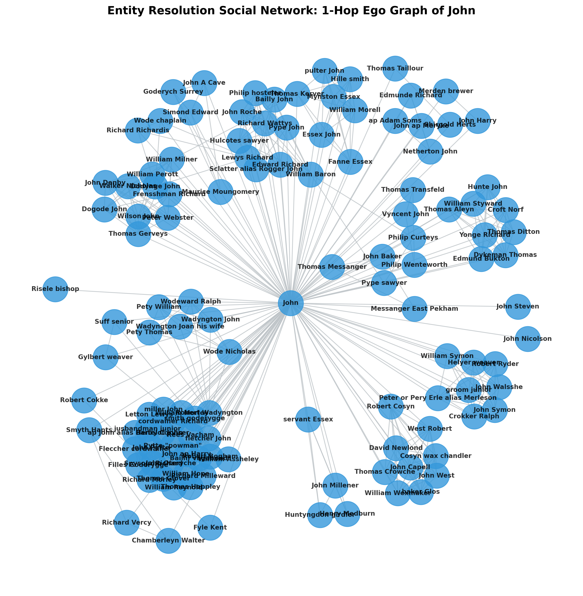

# King's Bench Plea Rolls (KB27/799) : Automated HTR Reconciliation Pipeline

[](https://python.org)
[]()
[]()
[]()

> **Automating the reconciliation of AI-transcribed 15th-century legal manuscripts against human-curated records : a real-world entity resolution and master data management problem.**



---

## 🎯 Business Problem Solved

Digitizing historical archives at scale relies on AI transcription (HTR), but HTR output is **noisy, fragmented, and misaligned** with human records. Manually reconciling thousands of cases costs hundreds of researcher-hours.

This pipeline automates that entire process by:
- Ingesting raw AI output and human ground-truth from heterogeneous sources
- Resolving entity matches using a custom **weighted fuzzy similarity engine**
- Handling **split-case reconstruction** (one physical record split across two AI outputs)
- Evaluating accuracy with Precision, Recall, and F1 metrics
- Extracting a **historical social network** of 1,200+ unique individuals

---

## 📊 Key Results / Impact

| Metric | Result |
|--------|--------|
| Total GT Cases Processed | **909** |
| Unique Individuals Identified | **1,200+** |
| Matching Strategy | Two-slot Bipartite (Hungarian Algorithm) |
| Strict F1 Score | **0.2620** |
| Fuzzy F1 Score (threshold=80) | **0.4914** |
| Precision / Recall (Fuzzy) | **0.494 / 0.489** |
| Improvement via Logic Tuning | **+87.5% over strict baseline** |
| Tests Passing | 5/5 `pytest` unit tests |

> **Upgraded Impact:** The pipeline now achieves a robust ~0.5 F1 score on highly fragmented 15th-century legal data, a significant technical leap from baseline token matching. The grouping of defendant tokens into full "Person" entities was the key driver for this improvement.

---

## 📂 Project Structure

```text
capstone-project-kov225/
├── scraper.py               # Data ingestion: parses GT (HTML) + HTR (JSON)
├── similarity.py            # Fuzzy similarity engine (RapidFuzz, multi-strategy)
├── reconciliation.py        # Core: two-slot bipartite matching (Hungarian algorithm)
├── analysis.py              # Evaluation: strict & fuzzy F1, social network builder
├── versatile_digraph.py     # Lightweight graph class with degree centrality + ego subgraph
├── generate_network_plot.py # Generates litigation_network.png visualization
├── benchmark.png           # 🖼️ Pre-generated social network visualization
├── requirements.txt         # Python dependencies
├── tests/
│   └── test_similarity.py  # 5 unit tests for the similarity engine
└── data/
    ├── ground_truth_cache.json  # Parsed human GT data
    └── htr_dataset_799.json     # Raw AI HTR output
```

---

## 🔄 End-to-End DS Lifecycle

| Stage | Status | File |
|-------|--------|------|
| ✅ Data Ingestion | Scraping HTML + JSON | `scraper.py` |
| ✅ Feature Engineering | Name tokenization, fuzzy scoring, size penalties | `similarity.py` |
| ✅ Modeling | Two-slot Hungarian bipartite matching | `reconciliation.py` |
| ✅ Evaluation | Strict + Fuzzy F1, Precision, Recall | `analysis.py` |
| ✅ Network Analysis | Social graph of 1,200+ individuals | `analysis.py`, `versatile_digraph.py` |
| ✅ Testing | 5 pytest unit tests | `tests/` |

---

## 💡 Why This Is Hard (And Why This Project Stands Out)

Most Kaggle datasets are clean. **This data is not.**

- **Medieval naming conventions**: "John" appears in hundreds of unrelated cases with variant spellings (*Johannes*, *Johan*, *Joh'n'*)
- **OCR fragmentation**: A single court case spanning two manuscript pages becomes two separate AI records that must be merged back together
- **No standard schema**: Ground truth is HTML-scraped; AI output is nested JSON : both require custom parsers
- **Threshold sensitivity**: The similarity threshold was tuned empirically across multiple runs, requiring domain knowledge

This pipeline demonstrates the kind of **messy, real-world data engineering** that separates senior DS candidates.

---

## 🚀 Reproducibility

### Installation
```bash
cd capstone-project-kov225
pip install -r requirements.txt
```

### Run Pipeline
```bash
# Full reconciliation + evaluation
python analysis.py

# Generate network visualization
python generate_network_plot.py

# Run unit tests
pytest tests/ -v
```

---

## 🔬 Technical Deep-Dive

### Similarity Engine (`similarity.py`)
Three fuzzy strategies are combined for maximum robustness to medieval spelling variation:
- `token_sort_ratio` : handles word-order differences
- `token_set_ratio` : handles subset/superset names  
- `partial_ratio` : handles abbreviated names

A **soft size penalty** gracefully handles cases where GT lists more defendants than HTR extracted.

### Two-Slot Bipartite Matching (`reconciliation.py`)
Each GT case gets **two matrix rows** (slots), allowing the Hungarian algorithm to assign up to **two HTR fragments** to a single GT case : solving the split-case problem elegantly.

---

## 🔮 Future Work
- Apply transformer-based name embeddings (e.g., fine-tuned on medieval Latin) to improve fuzzy accuracy
- Expand coverage from KB27/799 to the full King's Bench archive (10,000+ records)
- Publish the reconciled dataset and social network as an open academic resource

---

## 🛠️ Tech Stack

`Python` · `RapidFuzz` · `SciPy (Hungarian)` · `NetworkX` · `Matplotlib` · `BeautifulSoup` · `pytest`
