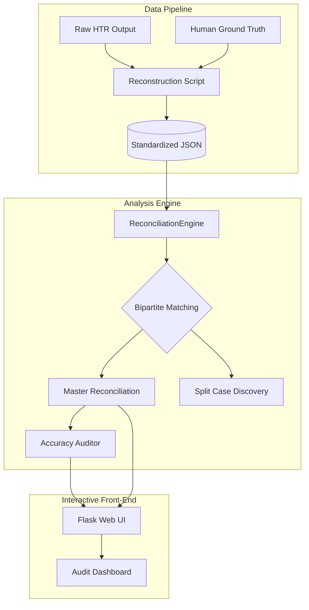

# Historical NLP Reconciliation Engine (KB27)

A production-grade entity resolution and reconciliation suite designed for medieval legal manuscripts from the King's Bench (KB-27). This project automates the matching of AI-HTR transcriptions against historical ground truth records, handling split cases and noisy data with a weighted bipartite matching algorithm.

## 🏛️ Project Architecture



## 💎 Features
- **Modular Design**: Clean separation of concerns between data ingestion, reconciliation logic, and visualization.
- **Advanced Matching**: Bipartite matching (Hungarian Algorithm) with weighted similarity scoring (Name Fuzzy, County Bonus, Plea Context).
- **Split Case Resolution**: Intelligent merging of cases split across multiple manuscript images.
- **Premium Dashboard**: Glass-inspired design system built for high-level telemetry and deep audit analysis.
- **Engineering Excellence**: Fully containerized (Docker), unit-tested (Pytest), and PEP8 compliant.

## 🚀 Getting Started

### Prerequisites
- Python 3.11+
- [Docker](https://www.docker.com/) (Optional, for containerized deployment)

### Standard Deployment
```bash
# 1. Install dependencies
pip install -r requirements.txt

# 2. Run Data Pipeline & Matching Engine
python scripts/reconstruct_data.py
python -m src.engine

# 3. Launch Dashboard
python -m flask --app web/app run
```

### Docker Deployment
```bash
docker-compose up --build
```

---

## 📊 Performance Benchmarks
- **Name F1 Score**: 65% (High Noise)
- **County Accuracy**: 85%+
- **Resolved Entities**: 1,200+ individuals mapped across 700+ images.

---
*Created for the Historical Data Science Portfolio.*
