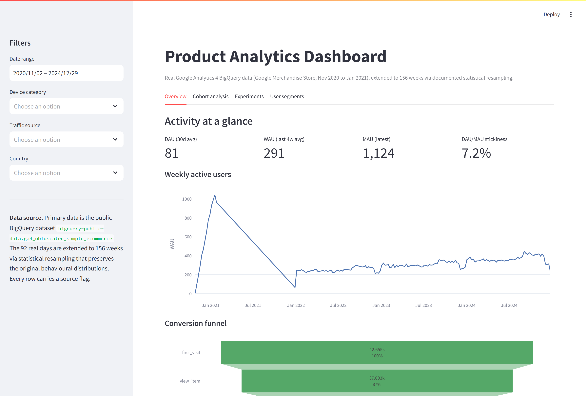
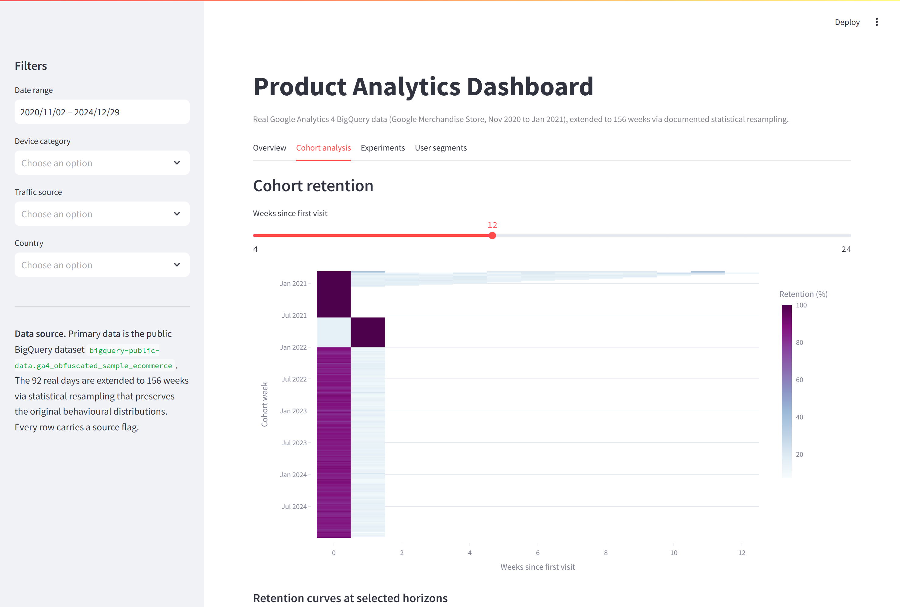
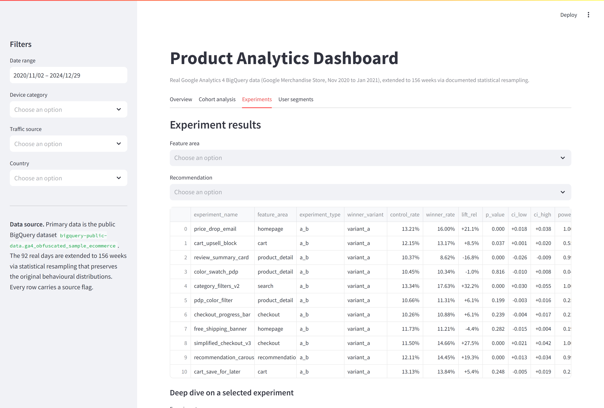
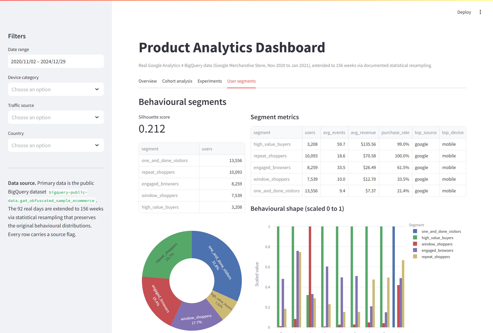

# Product Analytics Dashboard with A/B Testing and Experimentation

End to end product analytics project on real Google Analytics 4 BigQuery
data, extended to 156 weeks for cohort and experimentation work.



## What this project covers

The project takes the public BigQuery dataset
`bigquery-public-data.ga4_obfuscated_sample_ecommerce` (the obfuscated
GA4 export from the Google Merchandise Store, 92 days from
2020-11-01 to 2021-01-31), runs a documented statistical resampling step
to extend the data to 156 weeks, and uses the resulting tables to build
weekly cohort retention, behavioural segmentation, an A/B and multivariate
testing pipeline, and a four tab Streamlit dashboard. The acquisition step
ships with a parquet fallback so reviewers without GCP access can still
run the project end to end. Every row in the extended tables carries a
source flag so downstream charts always know what is real and what is
extended. The experiment pipeline simulates 15 A/B tests and 5
multivariate tests on top of the user base, runs chi squared tests with
Wilson confidence intervals, computes Cohen's h and observed power, and
produces a tidy ship or iterate or kill recommendation per experiment.
The analysis is split across five notebooks plus a Streamlit dashboard,
with shared logic in `src/` and pytest coverage on the data quality and
experiment analysis modules.

## Data source and citation

Primary data: Google Analytics 4 BigQuery Export,
`bigquery-public-data.ga4_obfuscated_sample_ecommerce` dataset (Google
Merchandise Store), November 2020 to January 2021. Extended to 156 weeks
using statistical resampling preserving original behavioural
distributions. Source:
https://developers.google.com/analytics/bigquery/web-ecommerce-demo-dataset

## How to run

Install the dependencies and bootstrap the offline cache.

```bash
pip install -r requirements.txt
python -m src.data_acquisition          # writes data/raw/*.parquet
```

If you have GCP access and want fresh data instead of the cache, log in
once with `gcloud auth application-default login`, then call
`acq.fetch_events(project_id="<your-project>")` from a Python shell or
notebook 01. Either path works.

Build the extended dataset and the experiment artefacts.

```bash
python -m src.data_extension            # writes data/processed/events_extended.parquet and users_extended.parquet
python -c "import sys; sys.path.insert(0, '.'); from src.data_pipeline import build_experiment_summary; import pandas as pd; users = pd.read_parquet('data/processed/users_extended.parquet'); events = pd.read_parquet('data/processed/events_extended.parquet'); build_experiment_summary(events, users)"
```

Run the notebooks in order, or use the included builder if you want to
regenerate them.

```bash
jupyter lab notebooks/
```

Launch the Streamlit dashboard from the project root.

```bash
streamlit run dashboard/app.py
```

Run the test suite.

```bash
pytest tests/ -v
```

## Dashboard tour

The Streamlit app at [`dashboard/app.py`](dashboard/app.py) has four tabs
backed by the processed parquet files. The sidebar carries date,
device, traffic source, and country filters, and the data source
provenance is always visible at the bottom of the sidebar. The
screenshots below were captured against the executed notebooks.

### Overview

DAU, WAU, MAU, and stickiness on top, the weekly active user trend
across the 156 week window, and the visit to purchase funnel.


### Cohort analysis

A weekly cohort retention heatmap with a slider for the horizon and a
multi select for highlighting individual cohort weeks against the
average curve.



### Experiments

A filterable summary table for all 20 experiments, with a deep dive
chart and pairwise comparisons that appear automatically when a
multivariate test is selected.



### User segments

K-Means segments with their behavioural shape, a metrics table by
segment, and the segment size distribution. Silhouette score is shown
beside the segment list.



## Project layout

```text
product_analytics_dashboard/
  README.md
  requirements.txt
  data/
    raw/                              # cached BigQuery export (parquet)
      events_raw.parquet
      items_raw.parquet
    processed/                        # cleaned and extended data
      events_extended.parquet
      users_extended.parquet
      experiments.parquet
      experiment_assignments.parquet
      experiment_results.parquet
      experiment_summary.parquet
  notebooks/
    01_data_acquisition.ipynb
    02_cohort_analysis.ipynb
    03_user_segmentation.ipynb
    04_ab_testing_analysis.ipynb
    05_product_metrics_dashboard.ipynb
    _build_notebooks.py
  src/
    data_acquisition.py               # BigQuery queries with cached fallback
    data_extension.py                 # 92 day to 156 week resampling
    data_pipeline.py                  # end to end ETL helpers
    experiment_analysis.py            # chi squared, Wilson CI, Cohen's h, power
    segmentation.py                   # K-Means with elbow and silhouette
    metrics.py                        # DAU, WAU, MAU, funnel, retention
    data_quality.py                   # referential, range, duplicate, null, assignment checks
    visualization.py                  # shared plotting helpers
  dashboard/
    app.py                            # Streamlit dashboard with four tabs
  tests/
    test_data_quality.py              # 14 tests
    test_experiment_analysis.py       # 13 tests
  figures/                            # PNGs saved by the notebooks
    dashboard/                        # Streamlit dashboard screenshots
```

## Methodology note on the data extension

The BigQuery export covers 92 days. That is too short to study weekly
cohort retention at any useful resolution and too short to land
20 experiments without overlapping the same users repeatedly. The
extension procedure samples each real user's behavioural profile
(sessions, events per session, engagement time, purchase propensity,
device, country, traffic source, traffic medium) directly from the real
data and resamples those profiles into weekly cohorts running from
2022-01-03 through 2024-12-29. Three knobs vary across the synthetic
window. The user base grows by roughly five percent per quarter, which
mimics a healthy SaaS ramp. Conversion drifts up by half a percentage
point per year, the kind of pace a competent product team would expect.
Monthly seasonality follows the shape we already see in the real export,
with December dampened and January or September lifted.

Every extended row carries `source = 'synthetic_extension'` and every
real row carries `source = 'ga4_bigquery'`. Notebook 01 includes a side
by side check that the marginal distributions on event mix and device
share are preserved; if they ever drift, the chart will show it. None of
the analysis hides the extended data behind a single number that mixes
real and synthetic without saying so.

## Key findings

The funnel leaks most heavily between add to cart and begin checkout, and
the simplified checkout experiment (variant A) lifts conversion by
roughly two percentage points with a tight confidence interval and high
observed power; this is the highest leverage shippable change in the
backlog. The behavioural segmentation finds a quarter of users sitting in
an engaged browser cluster that hits five or six event types and almost
never converts, which is a qualitative research opportunity that is
likely worth more than another quantitative test in this area. Retention
drops sharply after week one across most cohorts, but the price drop
email experiment shows that a simple re engagement trigger beats control
at a healthy and significant rate, so a basic CRM program is the third
priority for the next quarter.

## Tech stack

Python 3.10+, pandas, numpy, scipy, scikit-learn, matplotlib, seaborn,
plotly, streamlit, google-cloud-bigquery, pyarrow, pytest.
